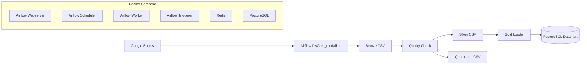

# Arsitektur Data Mart Fakultas Sains

Proyek ini adalah pipeline ETL berbasis Apache Airflow untuk mengolah data permohonan layanan mahasiswa dari Google Sheets ke data mart PostgreSQL.

## Gambaran Singkat

Pipeline memakai arsitektur medallion:
- **Bronze**: data mentah dari Google Sheets disimpan ke CSV.
- **Silver**: data divalidasi, dibersihkan, dan dipisahkan ke data layak pakai atau quarantine.
- **Gold**: data dimuat ke PostgreSQL sebagai tabel dimensi dan tabel fakta untuk analisis.

DAG utama bernama `etl_medallion` dan dijalankan otomatis setiap 2 menit.

## Alur Proses

1. Airflow mengambil data dari beberapa spreadsheet Google Sheets.
2. Data mentah disimpan ke folder `data/bronze/`.
3. Aturan kualitas diterapkan untuk validasi kolom, format, nilai, dan duplikasi.
4. Data lolos validasi disimpan ke `data/silver/`, sedangkan data gagal masuk ke `data/quarantine/`.
5. Data silver dimuat ke PostgreSQL ke schema `datamart`.

## Arsitektur Sistem

### Komponen Utama

- **Apache Airflow**: orkestrasi ETL, scheduling, dan monitoring DAG.
- **Google Sheets API**: sumber data utama.
- **Pandas**: transformasi dan validasi data.
- **PostgreSQL**: penyimpanan layer gold / datamart.
- **Redis**: broker untuk Celery Executor.
- **Docker Compose**: menjalankan seluruh stack secara lokal.

## Struktur Proyek

- `dags/` - definisi DAG Airflow.
- `utils/` - helper koneksi database, quality rules, dan gold loader.
- `config/` - schema datamart dan konfigurasi webserver.
- `data/` - file CSV bronze, silver, dan quarantine.
- `credentials/` - kredensial Google Sheets.
- `logs/` - log eksekusi Airflow.

## Catatan

Pastikan file `credentials/credentials.json` tersedia dan environment variable yang dibutuhkan sudah diisi sebelum menjalankan pipeline.